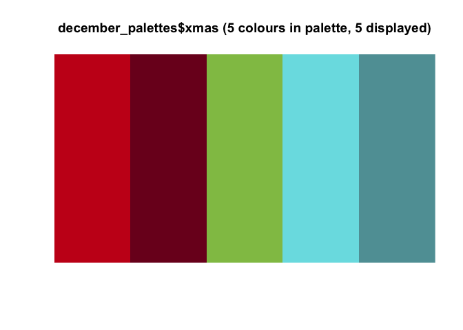

Making a personal colour palette package
================

# Step 1: Set up the libraries we’ll need

``` r
library("devtools")
```

``` r
library("tidyverse")
```


My December holiday example is based heavily on the ochRe package, an
‘Australian’ themed set of colour palettes.

``` r
devtools::install_github("ropenscilabs/ochRe")
```

``` r
library("ochRe")
```

# Step 2: Get your colours

## Decide on a theme for your colour palette

For this example I’ve made a December holiday themed palette, but what’s
something you’re interested in?

There are a bunch of themed palettes out there already to draw
inspiration from. Check out a list of some of them here:
<https://github.com/EmilHvitfeldt/r-color-palettes>.

There are lots inspired by movies (Studio Ghibli, Wes Anderson, Harry
Potter), by media like the Economist, the Wall Street Journal and
FiveThirtyEight and by Excel/Stata/Tableau
(<https://yutannihilation.github.io/allYourFigureAreBelongToUs/ggthemes/>),
by art like from Dutch masters
(<https://github.com/EdwinTh/dutchmasters>) or about Australia
(<https://github.com/ropenscilabs/ochRe>) by the colours in Beyonce’s
photos (<https://github.com/dill/beyonce>), by vapourwave
(<https://github.com/moldach/vapoRwave>)…and so. much. more.

Turn a beauty YouTuber’s eye shadow palettes into R palettes? What about
your favourite sports team or league? Holidays more generally? Your
creativity is the only limit.

## Get the hex codes

For more information about colour palettes, you might like the slides
from this lightning talk I gave in 2019.
<http://www.dataembassy.co.nz/Liza-colours-in-R#1>

You’ll usually see a colour written in one of 4 ways:

  - Just as a colour name, like “red”. Has to be one R recognizes -
    [list here](http://www.stat.columbia.edu/~tzheng/files/Rcolor.pdf)  
  - As a mix of hue, saturation and lightness (HSL)  
  - As a mix of redness, greenness and blueness (RGB)  
  - As 6 numbers/letters with a \# at the front e.g. \#ff0000 (Hex code)

We’ll be using hex codes for this example. If you’re ever working on the
colours for a personal website you’ll probably use hex codes there too.

coolors.co is great for pulling colours from an image and getting the
associated hex codes. You can input the URL for an image on the web,
without having to download.

``` r
browseURL("https://coolors.co/image-picker")
```

Let’s look at en example using this *Red and Turquoise Christmas colour
palette* from artsyfarstylife.com.


Once you’ve played around with the tool, you can click ‘Export’ and I’d
recommend copying from the ‘Code’ part, specifically the bit under /\*
Object \*/ as it is probably most useful to you.


In my case, this is what I got:

{“Lava”:“C8001C”,“Burgundy”:“7C0322”,“Pistachio”:“91C153”,“Sky Blue
Crayola”:“78DFE4”,“Cadet Blue”:“609FA4”}

I want to make this into proper R code, though:

``` r
# Notice that I am using = instead of <- here. This is important for the list version later
xmas = c(
  "#C8001C", # Lava
  "#7C0322", # Burgundy
  "#91C153", # Pistachio
  "#78DFE4", # Sky Blue Crayola
  "#609FA4"  # Cadet Blue
)
```

Notice that I have added hashtags before the hex codes and put the human
readable name next to each one as a comment. You don’t need to keep the
names, but might make it easier to makes changes later. The code just
creates a character vector with the hex codes for this palette, and I am
calling this palette ‘xmas’.

Repeat this as many times as you want to get vectors for each palette
that you want to include.

# Step 3: Create a list of palettes

From this point on we’re basically just going to copy the set up of the
[ochRe](https://github.com/ropenscilabs/ochRe) package.

The code chunk below is just a modified version of the colours.R code
from the ochRe package. You will want to create a version of the below
for your palettes and save it as an .R file in your package’s R folder.
I.e. the .R file should have the contents of the chunk below, modified
appropriately, and nothing else.

``` r
#' Colour Palettes for December Holidays
#' This code is heavily based on the set up of the ochRe package: https://github.com/ropenscilabs/ochRe/blob/master/R/colors.R
#'
#'A collection of colour palettes for a range of December holidays. The list of available palettes is:
#' hanukkah_rainbow
#' hanukkah_simple
#' xmas
#' yulelog
#' kwanzaa
#' winter_solstice
#'
#'@examples
#'
#' # Make an x-y plot using the winter_solstice palette
#' library(tidyverse)
#' df <- data.frame(x = rnorm(100, 0, 20),
#'           y = rnorm(100, 0, 20),
#'           cl = sample(letters[1:8], 100, replace=TRUE))
#' ggplot(df, aes(x, y, colour=cl, shape=cl)) +
#'   geom_point(size=4) + scale_colour_december() +
#'   theme_bw() + theme(aspect.ratio=1)
#'
#' # Make a histogram using the McCrea Collins Street palette
#' ggplot(df, aes(x, fill=cl)) + geom_histogram() +
#'   scale_fill_december(palette="hanukkah_rainbow")
#'
#' @export
december_palettes <- list(
  ## From Meri Makes Stuff on Tumblr https://meirmakesstuff.tumblr.com/post/190234482690/beyond-blue-and-white-a-jewish-holiday-resource
  ## Image address: https://64.media.tumblr.com/955c92e2de94c00083a7edeff33adea5/cfcebdd462167302-46/s1280x1920/8f1043f5c84ecfc94cedcfe4db1b6f196646adfa.jpg
  hanukkah_rainbow = c(
    "#B9000A", # International Orange Engineering
    "#37A839", # Green Pantone
    "#782F8F", # Eminence
    "#2092CD", # Blue NCS
    "#FE8B20", # Dark Orange
    "#F7DA6D", # Naples Yellow
    "#FB1265", # Paradise Pink
    "#EB570D", # Persimmon
    "#05102C"  # Oxford Blue
  ),

  ## Source: https://www.colourlovers.com/palette/1879017/Hanukkah
  hanukkah_simple = c(
    "#F2EBDB",
    "#9AB8C2",
    "#3A56A0",
    "#F2CD3C",
    "#DAAE4B",
    "#F2EBDB",
    "#9AB8C2",
    "#3A56A0"
  ),

  ## Red and Turquoise Christmas colour palette from artsyfarstylife.com
  ## https://artsyfartsylife.com/wp-content/uploads/2019/12/Modern-Red-Turquoise-Christmas-Color-Palette.jpg
  xmas = c(
    "#C8001C", # Lava
    "#7C0322", # Burgundy
    "#91C153", # Pistachio
    "#78DFE4", # Sky Blue Crayola
    "#609FA4"  # Cadet Blue
  ),

  # Buche de Noel, image by Dying for Chocolate
  # https://frenchly.us/wp-content/uploads/sites/9/2015/12/Buche-Miette.jpg
  yulelog = c(
      "#442A26", # Old Burgundy
      "#1A4B32", # British Racing Green
      "#AA8467", # Cafe Au Lait
      "#BD2C33", # Madder Lake
      "#7FAF7A", # Asparagus
      "#E1E0D9"  # Timberwolf
  ),

  # https://www.schemecolor.com/kwanzaa-flag-colors.php
  kwanzaa = c(
    "#E01022", # Medium Candy Apple Red
    "#111111", # Chinese Black
    "#137930"  # La Salle Green
  ),

  ## SOLSTICE WINTER COLOR PALETTE Allison J. Hart
  ## https://diariesofanessexgirl.com/solstice-winter-color-palette/
  winter_solstice = c(
    "#787878", # Steel
    "#90a8a8", # Mythical Blue
    "#7890a8", # Identity
    "#c0d8f0", # Light Blue Mist
    "#606048"  # Olive Court
  ))
```

## Visualize your palettes

You can take a look at your palettes right in R with the `viz_palette()`
function. We could write our own version of this function for our
package, but I’m just using the one from ochRe here.

``` r
ochRe::viz_palette(december_palettes$xmas)
```

<!-- -->

``` r
ochRe::viz_palette(december_palettes$hanukkah_rainbow)
```

<!-- -->

``` r
ochRe::viz_palette(december_palettes$winter_solstice)
```

<!-- -->

# Step 4: ggplot code

In ggplot you can modify colours for different aesthetics with functions
of the form `scale_fill_*()` or `scale_color_*()`. One I use a lot is
`scale_fill_brewer()`, it is part of the ggplot package and uses some of
the great palettes from <https://colorbrewer2.org/>.

As with the above, this whole chunk below should be saved as it’s own .R
file (maybe something like `scales.R`) in your packages R folder. Once
again, it was mostly a matter of looking at the ochRe version and
replacing things to match what I wanted them called. It makes two
functions, one for ‘colour’ situations and one for ‘fill’ situations in
ggplot. It also allows for either spelling of colour to be used.

``` r
#' december palettes with ramped colours
#' This code is heavily based on the set up of the ochRe package: https://github.com/ropenscilabs/ochRe/blob/master/R/scales.R
#'
#' @param palette Choose from 'december_palettes' list
#'
#' @param alpha transparency
#'
#' @param reverse If TRUE, the direction of the colours is reversed.
#'
#' @examples
#' library(scales)
#' show_col(dec_pal()(10))
#'
#' filled.contour(volcano,color.palette = dec_pal(), asp=1)
#'
#' @export
dec_pal <- function(palette="winter_solstice", alpha = 1, reverse = FALSE) {
  pal <- december_palettes[[palette]]
  if (reverse){
    pal <- rev(pal)
  }
  return(colorRampPalette(pal, alpha))
}

#' Setup colour palette for ggplot2
#'
#' @rdname scale_color_december
#'
#' @param palette Choose from 'december_palettes' list
#'
#' @param reverse logical, Reverse the order of the colours?
#'
#' @param alpha transparency
#'
#' @param discrete whether to use a discrete colour palette
#'
#' @param ... additional arguments to pass to scale_color_gradientn
#'
#' @inheritParams viridis::scale_color_viridis
#'
#' @importFrom ggplot2 scale_colour_manual
#'
#' @examples
#' library(ggplot2)
#' ggplot(mtcars, aes(mpg, wt)) +
#'   geom_point(aes(colour = factor(cyl))) +
#'   scale_colour_december(palette="xmas")
#' ggplot(mtcars, aes(mpg, wt)) +
#'   geom_point(aes(colour = hp)) +
#'   scale_colour_december(palette="xmas", discrete = FALSE)
#' ggplot(data = mpg) +
#'   geom_point(mapping = aes(x = displ, y = hwy, color = class)) +
#'   scale_colour_december(palette="kwanzaa")
#' ggplot(diamonds) + geom_bar(aes(x = cut, fill = clarity)) +
#'   scale_fill_december()
#' @export
#'
#' @importFrom ggplot2 discrete_scale scale_color_gradientn
scale_color_december <- function(..., palette="winter_solstice",
                              discrete = TRUE, alpha = 1, reverse = FALSE) {
  if (discrete) {
    discrete_scale("colour", "december", palette=dec_pal(palette, alpha = alpha, reverse = reverse))
  } else {
    scale_color_gradientn(colours = dec_pal(palette, alpha = alpha, reverse = reverse, ...)(256))
  }
}

#' @rdname scale_color_december
#' @export
scale_colour_december <- scale_color_december

#' #' Setup fill palette for ggplot2
#'
#' @param palette Choose from 'december_palettes' list
#'
#' @inheritParams viridis::scale_fill_viridis
#' @inheritParams dec_pal
#'
#' @param discrete whether to use a discrete colour palette
#'
#' @param ... additional arguments to pass to scale_color_gradientn
#'
#' @importFrom ggplot2 scale_fill_manual discrete_scale scale_fill_gradientn
#'
#' @export
scale_fill_december <- function(..., palette="winter_solstice",
                             discrete = TRUE, alpha=1, reverse = TRUE) {
  if (discrete) {
    discrete_scale("fill", "dec", palette=dec_pal(palette, alpha = alpha, reverse = reverse))
  }
  else {
    scale_fill_gradientn(colours = dec_pal(palette, alpha = alpha, reverse = reverse, ...)(256))
  }
}
```

# My `decemberLB` package

This is my quick attempt at a package that has some colour palettes for
December holidays. <https://github.com/elb0/decemberLB> I haven’t put
any work into the documentation, so don’t use it as a role model for
that\!

You can install it with `devtools::install_github()` (yes, my username
is elb0, I wish I’d picked a better one…If you haven’t set up an account
yet, just make it your name or initial and name or something nice and
professional like that\!).

``` r
devtools::install_github("elb0/decemberLB", ref = "main", force = TRUE)
```

    ## Downloading GitHub repo elb0/decemberLB@main

    ##      checking for file ‘/private/var/folders/9z/mqg8cp0j0xl6t3hk0n9c02_c0000gn/T/RtmpsWstUR/remotes13154398e57a3/elb0-decemberLB-71352f2/DESCRIPTION’ ...  ✓  checking for file ‘/private/var/folders/9z/mqg8cp0j0xl6t3hk0n9c02_c0000gn/T/RtmpsWstUR/remotes13154398e57a3/elb0-decemberLB-71352f2/DESCRIPTION’
    ##   ─  preparing ‘decemberLB’:
    ##      checking DESCRIPTION meta-information ...  ✓  checking DESCRIPTION meta-information
    ##   ─  checking for LF line-endings in source and make files and shell scripts
    ##   ─  checking for empty or unneeded directories
    ##   ─  building ‘decemberLB_0.0.0.9000.tar.gz’
    ##      
    ## 

``` r
library(tidyverse)
library(decemberLB)
```

    ## 
    ## Attaching package: 'decemberLB'

    ## The following objects are masked _by_ '.GlobalEnv':
    ## 
    ##     dec_pal, scale_color_december, scale_colour_december,
    ##     scale_fill_december

``` r
mtcars %>% 
  mutate(cyl = factor(cyl)) %>% 
  ggplot(aes(x = mpg, y = disp, color = cyl)) +
  geom_point() +
  theme_minimal() +
  scale_color_december(palette = "xmas") +
  ggtitle("My beautiful colour palette")
```

<!-- -->

``` r
df <- data.frame(x = rnorm(100, 0, 20),
           y = rnorm(100, 0, 20),
          cl = sample(letters[1:9], 100, replace=TRUE))
 

ggplot(df, aes(x, fill=cl)) + 
  geom_histogram(bins=10) +
  scale_fill_december(palette="hanukkah_rainbow") +
  ggtitle("So colour, much wow!")
```

<!-- -->

# Ideas for other things to do/explore

## Get colour hex codes from R instead of online

Learn to use the `magick` package to pull palettes from images with the
`image_quntize()` package. I wasn’t able to get the `magick` package
working in the Jupyter Hub environment so may not be an option if you
can’t get set up on your personal machine.
<https://www.r-bloggers.com/2019/01/extracting-colours-from-your-images-with-image-quantization/>

## Make sure your palettes are colour blind friendly and/or greyscale printing friendly

The `colorblindr` package might be interesting to explore, but I haven’t
used it myself. You can learn more about how to [design for colour
blindness](https://usabilla.com/blog/how-to-design-for-color-blindness/)
and try out a [colour blindness
simulator](https://www.color-blindness.com/coblis-color-blindness-simulator/).
The `dichromat` package also has some useful functions to simulate how
your palette might look with different types of colour-blindness.

## Check out this list of other resources

<https://www.dataembassy.co.nz/Liza-colours-in-R#46>
